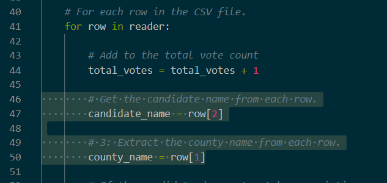

# Election_Analysis

## Project Analysis

### Project Overview
This project analyzes the election audit of a recent local congressional election provided by a Colorado Board of Elections employee.

1. Calculate total number of votes cast.
2. Get complete list of candidates who received votes.
3. Calculte total number of votes wach candidate received.
4. Calculate precentage of votes each candidate won.
5. Determine winner of election based on popular vote.

### Resources
- Data Source: election_results.csv
- Software: Python 3.6.7, Visual Studio Code 1.54.3

### Summary
The analysis of the election shows that:
- There were 369,711 votes cast in the election.
- The candidates were:
    - Charles Casper Stockham
    - Diana DeGette
    - Raymon Anthony Doane
- The candidate results were:
    - Charles Casper Stockham received 23.0% of the vote and 85,213 number of votes.
    - Diana DeGette received 73.8% of the vote and 272,892 number of votes.
    - Raymon Anthony Doane received 3.1% of the vote and 11,606 number of votes.
- The winner of the election was:
    - Candidate Diana DeGette who received 73.8% of the vote and 272,892 number of votes.

## Challenge Analysis

### Election Audit Challenge Overview
The analysis examines the election data for a recent local congressional election provided by a Colorado Board of Elections employee. The data for various counties and candidates are compared in order to determine which county had the largest voter turnout and which candidate received the most votes. 

### Election-Audit Results
- A total of 369,711 votes were cast in this congressional election.
- The county results were:
    -  Jefferson had 10.5% of the total votes with 38,855 number of votes. 
    -  Denver had 82.8% of the total votes with 306,055 number of votes.
    -  Arapahoe had 6.7% of the total votes with 24,801 number of votes.
-  Denver had the largest number of votes.
-  The candidate:
    - Charles Casper Stockham received 23.0% of the vote and 85,213 number of votes.
    - Diana DeGette received 73.8% of the vote and 272,892 number of votes.
    - Raymon Anthony Doane received 3.1% of the vote and 11,606 number of votes.
- Diana DeGette won the election with 73.8% of the total votes and 272,892 number of votes.

### Election-Audit Summary
This script can be utilized for any future election. By changing the file in line 9 of the code, the code will be able to analyze the data in the new file and output the results for each county and candidate. However, the file which will be uploaded must be in the same format as the "election_results.csv" file used for this analysis. This means the column headers and the information type for each column must remain the same. If the data file cannot be changed to match that of the current one, lines 47 and 49 in the code can be modified to match that of the new file. For line 47, change the number "2" inside the "[]" in order to match the column number the candidate names are found in. For line 49, change the number "1" inside the "[]" in order to match the column number the county names are found in. This will output the information in the same manner with the new file format.

.png)

